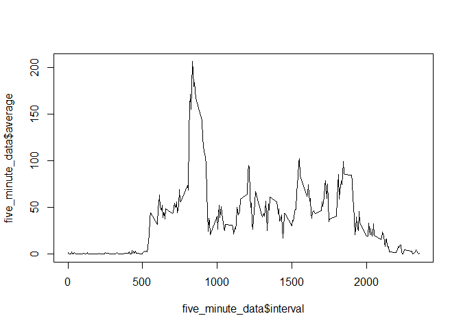

## Loading and preprocessing the data

We will be using the dplyr library to use data frame manipulation functions


```r
library(dplyr)
```

```
## 
## Attaching package: 'dplyr'
```

```
## The following objects are masked from 'package:stats':
## 
##     filter, lag
```

```
## The following objects are masked from 'package:base':
## 
##     intersect, setdiff, setequal, union
```

Loading the data is a two step process:

1. Check to see if the Zip file exists, if yes then unzip it
2. Read the 'csv' file using read.csv command


```r
path <- file.path("activity.zip")

if (!file.exists(file.path("activity.csv"))) { 
  unzip(path,exdir = file.path(getwd())) 
}

data <- read.csv("activity.csv")
```

## What is mean total number of steps taken per day?

First have a look at the data to see the type of values and columns

```r
head(data)
```

```
##   steps       date interval
## 1    NA 2012-10-01        0
## 2    NA 2012-10-01        5
## 3    NA 2012-10-01       10
## 4    NA 2012-10-01       15
## 5    NA 2012-10-01       20
## 6    NA 2012-10-01       25
```

Now let us answer the question. This will be answered in the following steps:

1. use complete.cases function to extract only the completed data
2. Use the pipeline operator "%>%" to do the following:
  2.1 first group by date
  2.2 then sum the total number of steps per date
3. Make the histogram of the total number of steps


```r
data_na_removed <- data[complete.cases(data),]

sum_data <- data_na_removed %>%
  group_by(date) %>%
  summarise(total = sum(steps))


hist(sum_data$total,main = "Total number of steps taken per day", xlab = "Total number of steps", ylab = "Frequency")
```

<!-- -->
Now calculate the mean of total number of steps


```r
mean(sum_data$total)
```

```
## [1] 10766.19
```
Now calculate the median of total number of steps


```r
median(sum_data$total)
```

```
## [1] 10765
```

## What is the average daily activity pattern?

To answer the question, the following steps were followed: 
1. Used the filetered data 'data_na_removed'
2. Use the pipeline operator to do the following:
  2.1 Group the 'data_na_removed' by interval
  2.2 then take the mean of the steps per interval
3. Plot the line graph with interval on the x-axis, and 'average' on the y-axis


```r
five_minute_data <- data_na_removed %>%
  group_by(interval) %>%
  summarise(average = mean(steps))


plot(five_minute_data$interval,five_minute_data$average,type="l")
```

<!-- -->
To find out the interval with the highest average steps, we use the which.max function


```r
five_minute_data[which.max(five_minute_data$average),]
```

```
## # A tibble: 1 x 2
##   interval average
##      <int>   <dbl>
## 1      835    206.
```


## Imputing missing values

First we calculate the total number of missing values.
To do that, we are going to use the complete.cases function to find out the number of missing values


```r
paste("The number of missing values are : ",count(data[!complete.cases(data),]))
```

```
## [1] "The number of missing values are :  2304"
```

The data frame 'five_minute_data' contains the average per interval across all days. We are going to us this to miss the missing values with the average value for that interval per day.

To fill the missing values we are going to do the following:

1. Make a copy of the original data frame 'data'
2. loop over all the rows of the 'missing_values_data' data frame
3. if the ith row contains a missing value, then get the average value for that interval from 'five_minute_data' and copy it to the steps value

After we have filled the missing values we are going to summarize the data according to date and then sum the steps

Then plot the histogram


```r
missing_values_data <-data.frame(data)

for(i in 1:nrow(missing_values_data)){
 if(is.na(missing_values_data[i,1]))
 {
   missing_values_data[i,1] <- five_minute_data[five_minute_data$interval==missing_values_data[i,3],2]
 }
}

sum_data <- missing_values_data %>%
  group_by(date) %>%
  summarise(total = sum(steps,na.rm = T))

hist(sum_data$total,main = "Total number of steps taken per day \n (with missing values filled with average values)", xlab = "Total number of steps", ylab = "Frequency",col="green")
```

<!-- -->
With missing values filled in, we can observe that the maximum frequency has moved towrds 35 from 25 in the 10,000 - 15,000 range

## Are there differences in activity patterns between weekdays and weekends?

Step 1) To find out the differences in the activity pattern between weekdays and weekends, we are going to first use the 'missing_values_data' that has the missing values filled in, to create a new column 'wkend' to mark whether a date is a weekday or not. 

To have this column added we are going to use the mutate function of the dplyr library.

The value of the column is going to be true if the date is either "Saturday" or "Sunday", false otherwise

Step 2)  Then we are going convert the 'wkend' column as a factor and define levels as "Weekday" and "Weekend"

Step 3) Summarize the data by grouping them on wkend and interval and then averaging the number of steps

Step 4) Use the lattice plotting system to make the xyplot of average steps per interval per day type


```r
library(lattice)
### Step 1
missing_values_data <- mutate(missing_values_data, wkend =( weekdays(as.Date(data$date)) == "Saturday" | weekdays(as.Date(missing_values_data$date)) == "Sunday" ))

### Step 2 Convert to factors
missing_values_data$wkend <- as.factor(missing_values_data$wkend)

levels(missing_values_data$wkend) <- c("Weekday","Weekend")

### Step 3 Summarize data

sum_data <- missing_values_data %>%
  group_by(wkend,interval) %>%
  summarise(average = mean(steps))


xyplot(average ~ interval | wkend, data = sum_data, type="l",layout=c(1,2))
```

<!-- -->
